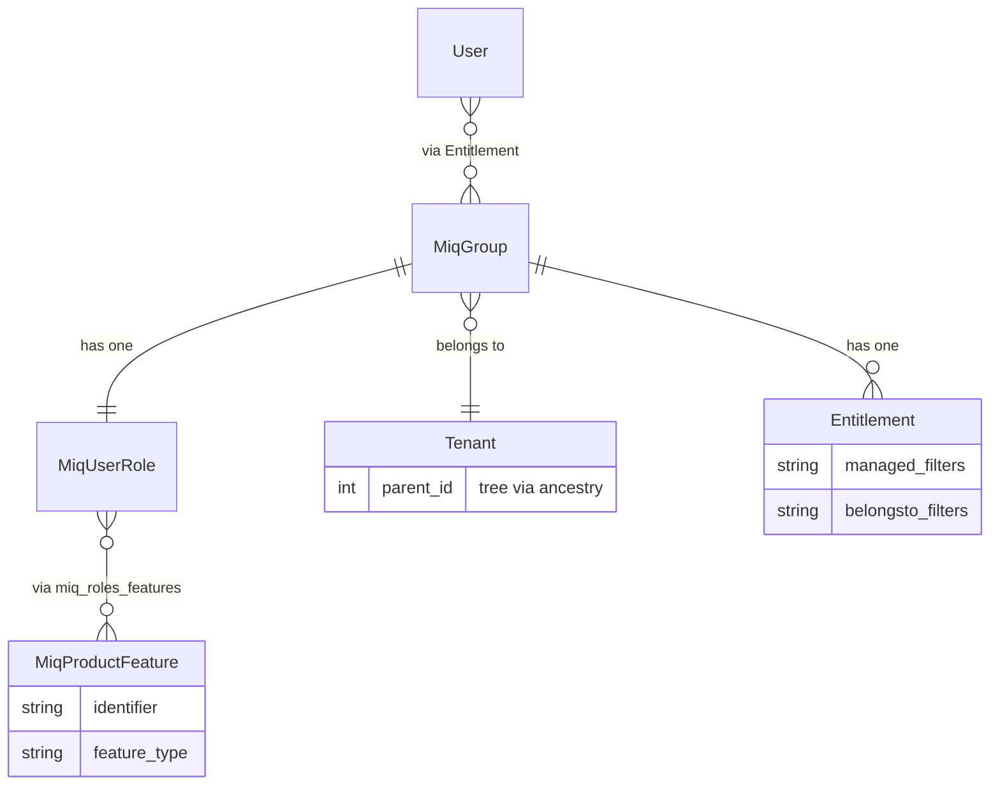

# RBAC (Role-Based Access Control)

ManageIQ enforces authorization at the data-retrieval layer via `Rbac::Filterer` (`lib/rbac/filterer.rb`). It is **not** automatic — you must call it explicitly for any user-facing query.

## The golden rule

Never use raw `.where` for user-facing record retrieval. Always go through:

```ruby
Rbac.search(class: VmOrTemplate, user: current_user)   # returns [records, attrs]
Rbac.filtered(VmOrTemplate.all, user: current_user)    # returns records
Rbac.filtered_object(vm, user: current_user)           # returns object or nil
```

`Rbac.search` is the full entry point (supports paging, counts, filters). `Rbac.filtered` and `Rbac.filtered_object` are convenience wrappers that call `search` internally.

## Data model



- **`User`** — a person or service account. Belongs to one or more `MiqGroup`s; one group is the *current group* that determines active permissions.
- **`MiqGroup`** — links a user to a role and a tenant. Carries the managed/belongsto filter assignments (`Entitlement`).
- **`MiqUserRole`** — defines what actions are allowed. Has many `MiqProductFeature` records via the join table `miq_roles_features`.
- **`MiqProductFeature`** — a tree of feature identifiers (e.g. `"vm_explorer"`, `"vm_power_on"`). The root feature `"everything"` is the super-admin grant. Roles are checked with `role.allows?(identifier:)`, which walks up the feature tree.
- **`Entitlement`** — the join model between `MiqGroup` and `MiqUserRole`; also stores the group's managed and belongsto filter expressions.

## Tenancy

Every `MiqGroup` belongs to a `Tenant`. Tenants form a tree; child tenants can see resources owned by their ancestors (and vice-versa for some resource types). The `TENANT_ACCESS_STRATEGY` hash in `Rbac::Filterer` defines the traversal direction per model:

| Strategy | Meaning |
|---|---|
| `:descendant_ids` | All child tenants can see the resource (e.g. `Vm`) |
| `:ancestor_ids` | All parent tenants can see the resource (e.g. `ExtManagementSystem`, `ServiceTemplate`) |
| `nil` | Only the owning tenant can see the resource (e.g. `OrchestrationStack`) |

Models not in `TENANT_ACCESS_STRATEGY` are not tenant-scoped.

## Filter types

Filters live on the group's `Entitlement` and are stored as `MiqExpression` or tag-path arrays. `Rbac::Filterer` evaluates all active filters and intersects/unions the resulting ID sets.

### Managed filters (tag-based)

Restrict records to those carrying specific tag categories/values. Only classes listed in `TAGGABLE_FILTER_CLASSES` (a superset of `CLASSES_THAT_PARTICIPATE_IN_RBAC`) are subject to managed filters.

### Belongsto filters (tree-based)

Restrict records to those that belong to a given infrastructure node — a datacenter, cluster, host, resource pool, or infrastructure folder. Only classes in `BELONGSTO_FILTER_CLASSES` are subject to belongsto filters. Note: belongsto filters force Ruby-side filtering (SQL LIMIT cannot be applied), which has performance implications on large datasets.

### Self-service / ownership filters

Roles can be marked as *self-service* (see `MiqUserRole#self_service?`) to restrict users to objects they own (`OwnershipMixin`) or that belong to their group. This is combined with other filters via union.

## Adding a class to RBAC

For tag-based RBAC to apply to a new class, **both** of the following must be true:

1. The class is listed in `Rbac::Filterer::CLASSES_THAT_PARTICIPATE_IN_RBAC`
2. The model includes `acts_as_miq_taggable`

If the class should also be subject to belongsto filters, add it to `BELONGSTO_FILTER_CLASSES`.

If the class should be tenant-scoped, add an entry in `TENANT_ACCESS_STRATEGY`.

## Feature-flag checks (UI/API access)

Checking whether a user can perform an action is separate from the data-retrieval filter:

```ruby
current_user.role_allows?(:identifier => "vm_power_on")
```

Feature identifiers are seeded from `db/fixtures/miq_product_features.yml` (and per-plugin equivalents). The tree is hierarchical — granting a parent feature implicitly grants all its children.

## Specs

Use the `:user` factory with a `features:` transient, or the `stub_user` helper from `spec/support/auth_helper.rb`. For data-scoping tests use `Rbac.filtered` directly rather than mocking the filterer.

```ruby
# create a user whose role allows specific features
let(:user) { FactoryBot.create(:user, :features => %w[vm_explorer]) }

# super-admin shortcut
let(:admin) { FactoryBot.create(:user_admin) }

# controller/request specs — stubs User.current_user and session
stub_user(:features => %w[vm_power_on])
stub_admin   # equivalent to stub_user(:features => :all)
```
